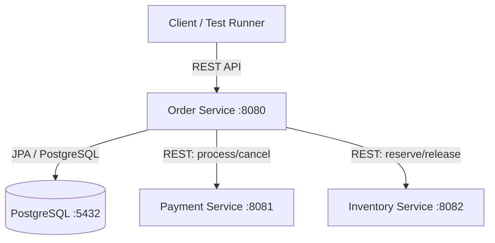
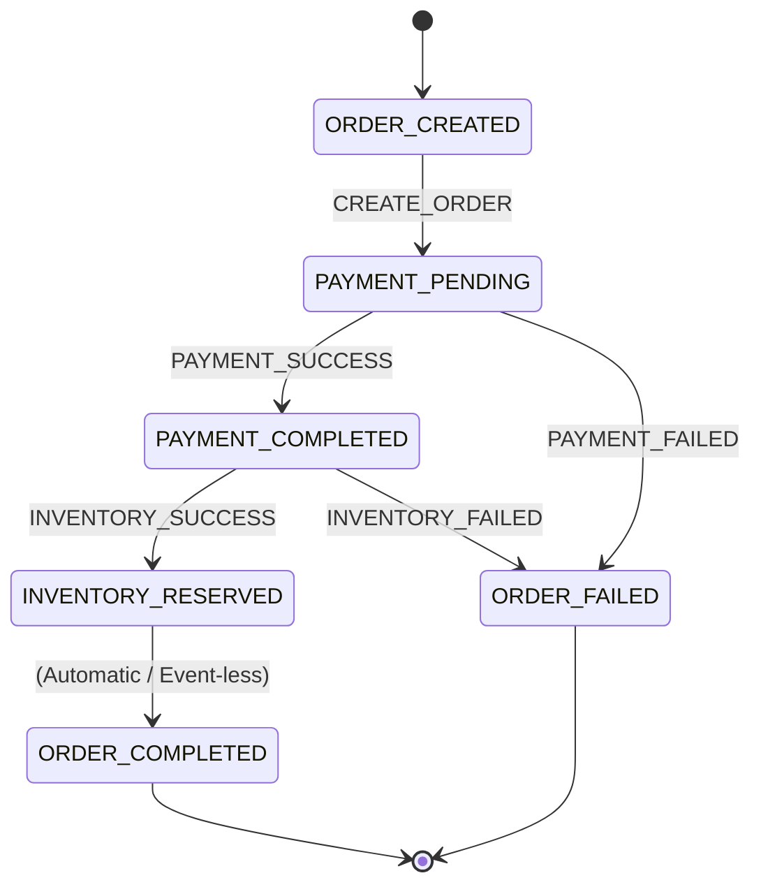

# Distributed Transactional Saga - Order Management System

A fault-tolerant, production-grade Order Management System demonstrating the Saga Orchestration pattern using **Spring Boot 3.x**, **Java 21**, **Spring State Machine**, **Spring Data JPA**, **PostgreSQL**, and **Docker / Docker Compose**.

---

## 1. Architecture

### System Topology
The system consists of three Spring Boot microservices and a PostgreSQL database.

* **Order Service (Orchestrator)**: Acts as the Saga Orchestrator. It maintains state transitions in PostgreSQL using Spring State Machine persistence and coordinates operations across the payment and inventory microservices.
* **Payment Service**: Processes and cancels (compensates) payments.
* **Inventory Service**: Reserves and releases (compensates) item stocks.



### Saga State transitions


---

## 2. Environment Variables

Generate a `.env` file in the root directory from `.env.example`:

| Variable | Default Value | Description |
|---|---|---|
| `DB_NAME` | `saga_db` | PostgreSQL Database Name |
| `DB_USER` | `user` | Database Username |
| `DB_PASSWORD` | `password` | Database Password |
| `PAYMENT_SERVICE_URL` | `http://payment-service:8081` | URL of the Payment microservice |
| `INVENTORY_SERVICE_URL` | `http://inventory-service:8082` | URL of the Inventory microservice |
| `SPRING_DATASOURCE_URL` | `jdbc:postgresql://db:5432/saga_db` | Spring database URL connection |
| `SPRING_DATASOURCE_USERNAME` | `user` | Spring database connection username |
| `SPRING_DATASOURCE_PASSWORD` | `password` | Spring database connection password |

---

## 3. Getting Started

### Prerequisites
* Java 21 JDK or higher
* Apache Maven (for local runs)
* Docker & Docker Compose (for containerized runs)

### Running locally

#### Step 1: Run PostgreSQL
Start a local PostgreSQL instance on port `5432` with a database named `saga_db` (or as configured in `.env`).

#### Step 2: Start Downstream Services
In separate terminal sessions, execute:
```bash
# In payment-service/
mvn spring-boot:run

# In inventory-service/
mvn spring-boot:run
```

#### Step 3: Start Order Orchestrator Service
```bash
# In order-service/
mvn spring-boot:run
```

---

### Running with Docker Compose
To build and start all microservices along with PostgreSQL in one command, run:
```bash
docker-compose up --build -d
```
All services will initialize and start cascadingly once their healthy conditions are met.

---

## 4. API Endpoints

### Order Service (Orchestrator)

#### 1. Create Order
* **URL**: `POST /api/orders`
* **Content-Type**: `application/json`
* **Request Body**:
```json
{
  "orderId": "100",
  "customerId": 1,
  "productId": 1,
  "quantity": 2,
  "unitPrice": 50.00
}
```
* **Success Response (HTTP 201)**:
```json
{
  "orderId": "100",
  "customerId": 1,
  "productId": 1,
  "quantity": 2,
  "unitPrice": 50.00,
  "amount": 100.00,
  "status": "ORDER_COMPLETED"
}
```

#### 2. Get Order Details
* **URL**: `GET /api/orders/{orderId}`
* **Success Response (HTTP 200)**:
```json
{
  "orderId": "100",
  "customerId": 1,
  "productId": 1,
  "quantity": 2,
  "unitPrice": 50.00,
  "amount": 100.00,
  "status": "ORDER_COMPLETED"
}
```

---

## 5. Saga Failures & Compensation Flow

We use order IDs from `submission.json` to simulate transaction failures:

### 1. Payment Failure
* **Trigger**: Create an order with `orderId` = `"201"`.
* **Flow**:
  1. State machine enters `PAYMENT_PENDING`.
  2. Order service requests payment; Payment Service returns `HTTP 500`.
  3. State transitions directly to `ORDER_FAILED`.
  4. *Inventory is never called.*

### 2. Inventory Failure & Compensation
* **Trigger**: Create an order with `orderId` = `"302"`.
* **Flow**:
  1. State machine enters `PAYMENT_PENDING`.
  2. Order service requests payment; Payment Service succeeds (`HTTP 200`).
  3. State transitions to `PAYMENT_COMPLETED`.
  4. Order service requests inventory reservation; Inventory Service returns `HTTP 500`.
  5. State transitions to `ORDER_FAILED`.
  6. **Compensating Action**: Orchestrator sends a cancellation request to Payment Service (`POST /api/payments/cancel`) to refund the customer.

---

## 6. Restart Recovery Scenario

To test state machine persistence and automatic saga recovery:

1. Create a successful order `"100"`.
2. The Payment Service will simulate a **5-second delay** during the first attempt.
3. While the orchestrator is waiting in the `PAYMENT_PENDING` state, kill/restart the Order Service container:
   ```bash
   docker-compose restart order-service
   ```
4. On startup, the `SagaRecoveryRunner` will automatically fetch the pending transaction from PostgreSQL, restore the State Machine context, and resume the orchestration.
5. The Payment Service handles the retry idempotently (succeeding immediately on the second call) and the transaction completes automatically to `ORDER_COMPLETED`.

---

## 7. Testing

To run the unit and integration tests (isolated from external dependencies using H2 memory database):

```bash
cd order-service
mvn test
```
The test suite includes:
* **Unit Tests**: State machine configurations and transitions.
* **Integration Tests**: Success, payment failure, inventory failure, and compensation paths.
* **Persistence Tests**: State machine persistence and JVM restart recovery scenarios.
